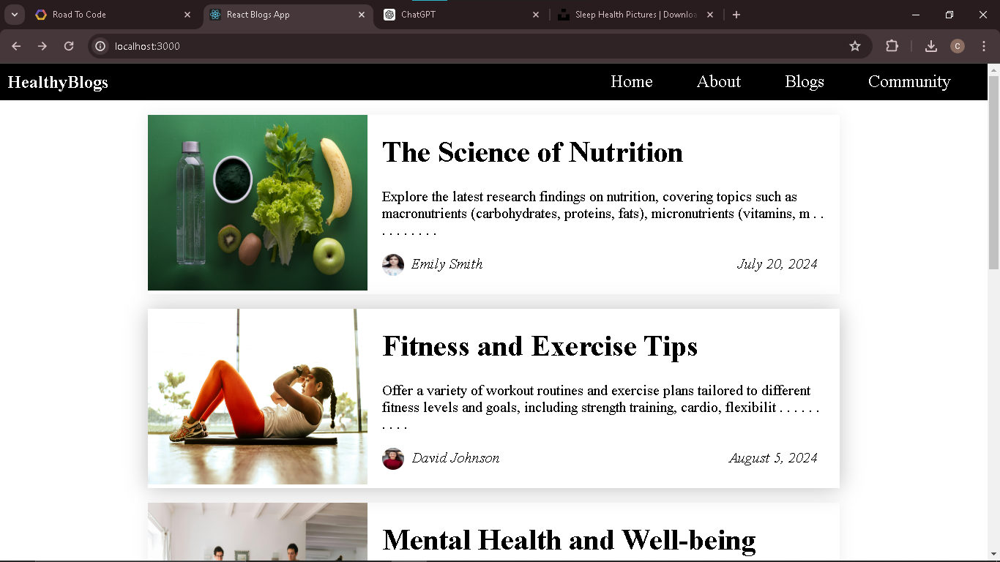

# HealthyBlogs - Health and Fitness Blog App

Welcome to **HealthyBlogs**, a dynamic blog application that provides a variety of blogs on health and fitness. This project is built using React.js and focuses on advanced routing concepts, such as dynamic routing, mapping, and parameter passing.

## Table of Contents

- [Description](#description)
- [Features](#features)
- [Usage](#usage)
- [Components](#components)
- [Data Structure](#data-structure)
- [Technologies Used](#technologies-used)
- [Future Enhancements](#future-enhancements)
- [Contributing](#contributing)
- [License](#license)

## Description

HealthyBlogs is a React.js application created to practice advanced routing concepts like dynamic routing. This app also covers key React concepts, including mapping, passing routing parameters, and using the `find` function and `substring` method. 

In this project:
- Dynamic routing is implemented by creating views.
- Only the Home view is created as of now.
- All necessary libraries are imported.
- A static array of blog data is created (in future projects, this data will be user-generated with backend support).

The project demonstrates how to display blog content in a card format by creating a reusable blog component. It also showcases the use of destructuring in React components.

## Features

- Dynamic routing with React Router
- Display blogs in a card format
- Home view with a list of blog cards
- Detailed blog view using routing parameters
- Static data array for blogs

## Usage
Once the development server is running, you can access the app in your web browser at http://localhost:3000. The Home view will display a list of blog cards. Clicking on a blog card will navigate to a detailed view of the selected blog using dynamic routing.

## Components

- BlogCard: Displays individual blog details in a card format.
- Home: Renders a list of blog cards using the BlogCard component.
- Blog: Displays detailed information about a selected blog using routing parameters.
- Navbar: (Future enhancement) Navigation bar for the application.




## Data Structure
The blog data is currently stored in an array of objects. Each object represents a blog with the following structure:
```const BlogData = [
  {
    id: "The Science of Nutrition",
    blogImg: Server,
    title: "The Science of Nutrition",
    about: "Explore the latest research findings on nutrition...",
    author: {
      name: "Emily Smith",
      authorImg: Emily,
      date: "July 20, 2024",
    },
  },
  // Additional blog objects...
];
```

## Technologies Used
1.React.js
2.React Router
3.JavaScript (ES6+)
4.CSS

## Future Enhancements

- Add backend support for user-generated blog content
- Implement authentication and user profiles
- Create additional views (e.g., About, Contact)
- Enhance the Navbar component for better navigation
- Improve styling and responsiveness

